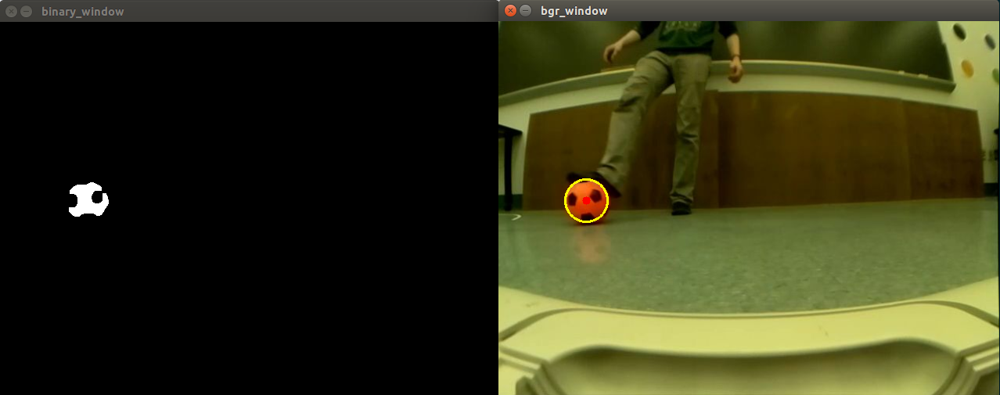

# Predicting an Object’s Future Position

[Riley Chapman](https://github.com/rileychapman), [Bonnie Ishiguro](https://github.com/bishiguro), and [Shane Kelly](https://github.com/shanek21)

## Project Goal
Our goal was to be able to detect, localize, and predict the trajectory of a soccer ball based on its position and velocity.

## Our System


### Ball Detection

Our ball detection algorithm is based on color thresholding and contour detection. After thresholding for the color of the ball (in HSV), a smallest bounding circle is drawn around the largest contour.



### Ball Localization

Given that we know the size of the ball, we can determine how far away it is from the camera using the equation,

```
Distance = Focal_Length * Ball_Radius / Perceived_Radius
```

The focal length of raspi camera with the fisheye attachment is known from the camera calibration, which is published on the /camera/camera_info topic. The Ball_Radius is given in meters, so that the output Distance is also in meters. The Perceived_Radius is given by the size of the bounding circle, which is in units of pixels.

With the focal length, we can also determine the x and y slopes of ball from the camera using the equations,

```
X/Z =  x_cam / focal length
Y/Z =  y_cam / focal length
```

where (x_cam, y_cam) are the coordinates of the center of the bounding circle from the optical center of the image, which can also be found in the camera calibration data. In our case, the optical center of the image was within half a pixel of the middle pixel.
    The 3D coordinates of the ball can then be calculated relative to the camera by placing it at the calculated distance along the line defined by the slopes. 


The above image is from Paul Ruvolo's [course website](https://sites.google.com/site/comprobo17/in-class/day-13) for *Introduction to Computational Robotics* at Olin College.

### Velocity Estimation

The velocity of the ball is determined by comparing its current position with the position from the previous time step. We found this estimation to be very noisy, so we compute a rolling average of the latest 10 velocities. 

## Design Decision

We spent time experimenting with algorithms for detecting the ball in the camera frame.  We originally tried using OpenCV’s Hough Circle Transform function to detect circles, but this was difficult to tune.  It also did not work well with our undistorted camera image because the undistortion would result in slightly oblong ball shapes.  We then discovered OpenCV’s findContours function, which is used to find shape outlines.  This proved to be more flexible and reliable than Hough circle detection for our purposes, allowing us to do real-time ball tracking without significant lag.

## Code Architecture

We structured our code in three object-oriented ROS nodes.  The “detector” detects and tracks balls of a given color within the camera frame.  This node subscribes to the camera feed, the “/camera/image_rect_color” topic and publishes a circle that represents a detected ball.  The “localizer” subscribes to the “detected_ball” topic and based on the ball’s position in the camera image, it calculates its position in 3-dimensional space.  The “predictor” subscribes to the “ball_3d_position” topic and uses the ball’s position over time to estimate its velocity.  We display the camera image feed, a binary image that results after applying a color threshold to the camera image, and a drawn circle over the camera image that represents a detected ball.

## Challenges

Despite having done ball detection in the past, we had to spend a decent amount of time making our detection of the ball robust enough to be used for 3D localization. This required BGR conversion to HSV, Gaussian blurring, color masking, contour detection, and a clever system of assuming that a minimally sized circle drawn around the largest detected contour would be our object of interest (the ball). Before making this assumption, we tried to detect circles in our color-filtered binary image using a Hough Transform. This Hough Transform method was unreliable, difficult to tune, and computationally expensive.

## Future Improvements

If we had more time, we would like to include more interaction with the Neato.  Although we met our MVP, our original plan involved having the Neato determine whether it should avoid or collide with a ball in its camera frame based on its color.

## Lessons Learned

The goals of our project separated really nicely into three distinct functionalities: detect a ball, localize the ball, and predict the ball’s future position. This created an excellent opportunity for us to take full advantage of ROS nodes (one each for detect, localize, and predict) to create a beautifully organized software system. This made many steps of our project (developing new code, fixing issues in old code, and understanding code that someone else had written) all much easier.

